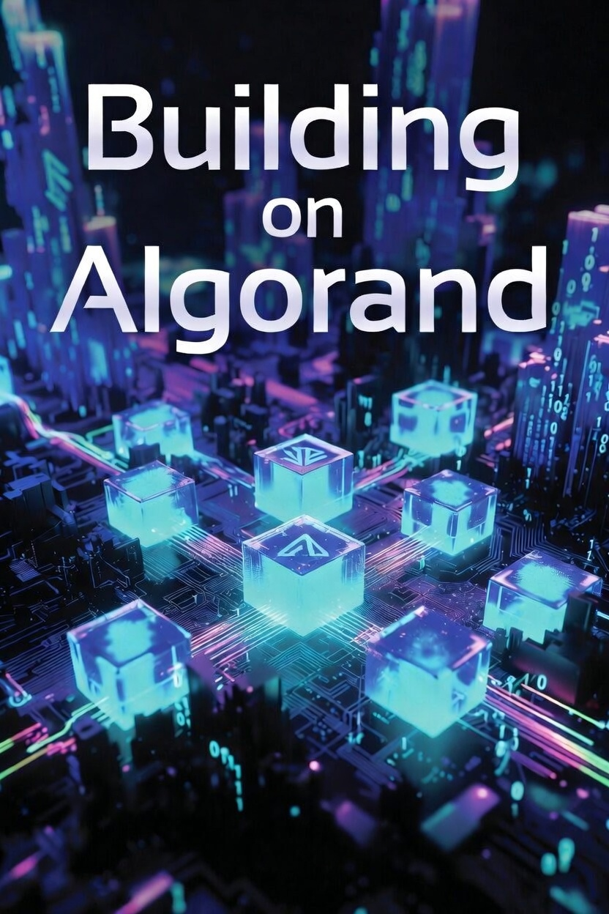

<p align="center">
  
</p>

# Building on Algorand

**Smart Contracts from First Principles to Production DeFi**

[**Read the book online**](https://m1o1.github.io/building-on-algo/)

1. [The Algorand Mental Model](https://m1o1.github.io/building-on-algo/01-the-algorand-mental-model.html)
2. [Testing Smart Contracts](https://m1o1.github.io/building-on-algo/02-testing-smart-contracts.html)
3. [A Token Vesting Contract](https://m1o1.github.io/building-on-algo/03-a-token-vesting-contract.html)
4. [NFTs — Extending the Vesting Contract with Transferability](https://m1o1.github.io/building-on-algo/04-nfts.html)
5. [A Constant Product AMM](https://m1o1.github.io/building-on-algo/05-a-constant-product-amm.html)
6. [Yield Farming — Extending the AMM with Staking Rewards](https://m1o1.github.io/building-on-algo/06-yield-farming.html)
7. [Common Patterns and Idioms](https://m1o1.github.io/building-on-algo/07-common-patterns-and-idioms.html)
8. [Delegated Limit Order Book with LogicSig Agents](https://m1o1.github.io/building-on-algo/08-delegated-limit-order-book.html)
9. [Private Governance Voting with Zero-Knowledge Proofs](https://m1o1.github.io/building-on-algo/09-private-governance-voting.html)

---

A hands-on guide that takes a senior software engineer from zero smart contract knowledge to deploying production-quality DeFi applications on Algorand. Written for developers who know Python well but have never built a smart contract.

All contracts use **[Algorand Python (Puya)](https://dev.algorand.co/concepts/smart-contracts/languages/python/)** — real Python code that compiles to TEAL bytecode via a multi-stage optimizing compiler.

## What You'll Build

| Chapter | Project | Concepts |
|---------|---------|----------|
| 1 | **The Algorand Mental Model** | Execution model, account system, AVM constraints, dev environment setup |
| 2 | **Testing Smart Contracts** | Test-first development, LocalNet testing, simulate API, coverage patterns |
| 3 | **Token Vesting Contract** | State management, ASA handling, inner transactions, box storage, integer math, security patterns |
| 4 | **NFT Extension** | Ownership-by-asset pattern, ARC-3 metadata, clawback mechanics, simulate-then-submit |
| 5 | **Constant Product AMM** | Uniswap V2-style AMM, multi-token accounting, price curves, LP token mechanics, TWAP oracle |
| 6 | **Yield Farming** | Staking rewards, reward-per-token accumulators, time-weighted multipliers, cross-contract state reads |
| 7 | **Common Patterns & Idioms** | Fee subsidization, MBR lifecycle, canonical ordering, event emission, opcode budget management |
| 8 | **Delegated Limit Order Book** | Logic Signatures, hybrid stateful/stateless architecture, template variables, keeper bots |
| 9 | **Private Governance Voting** | Zero-knowledge proofs, elliptic curve operations (BN254), MiMC hash, post-quantum security |

Plus two appendices: a **Smart Contract Cookbook** with 50+ standalone recipes, and a **Gotchas Cheat Sheet** of common mistakes and how to avoid them.

## Building Locally

The canonical source is the `chapters/` directory — each chapter is a separate `.md` file. All other formats are derived from these files via `build.py`.

### Prerequisites

- **mdbook** (for HTML): `brew install mdbook`
- **pandoc + xelatex** (for PDF): `brew install pandoc` and a TeX distribution (e.g. [MacTeX](https://www.tug.org/mactex/))

### Build Commands

```bash
# Build the mdbook (static HTML site) → outputs to mdbook/book/
python3 build.py mdbook

# Build the PDF via pandoc + xelatex
python3 build.py pdf

# Build both
python3 build.py all

# Reconstruct single Building-on-Algorand.md from chapters
python3 build.py concat
```

## Disclaimer

This book was generated with the assistance of AI (Claude, by Anthropic). The cover image was generated with Grok (xAI). While the code has been compiled, tested, and reviewed, it may contain errors or outdated information. **The smart contracts are for educational purposes** — any code intended for mainnet **must undergo a professional security audit**. See the full [Legal Notice](https://m1o1.github.io/building-on-algo/) in the book.

## License

[MIT](LICENSE)
